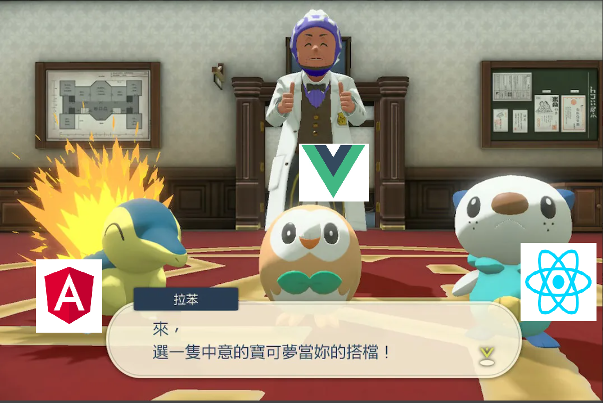

# UI

## About



作業練習

## Details

- https://github.com/hexschool/2022-web-layout-training

- https://github.com/kancheng/2022-web-layout-training

- https://github.com/kancheng/ui-note

- https://github.com/kancheng/learn-in-works

## Server

1. Web dev Server：https://webpack.js.org/guides/development/#using-webpack-dev-server

- https://github.com/webpack/webpack-dev-server

2. PHP

```
php -S 0.0.0.0:7878
```

3. Gulp : https://gulpjs.com/

4. Preview on Web Server : https://marketplace.visualstudio.com/items?itemName=yuichinukiyama.vscode-preview-server

5. Python Server :

```
python3 -m http.server
python -m http.server
```

- Create a Python Web Server : https://pythonbasics.org/webserver/


## Reference

1. https://github.com/guzzle/test-server

- https://github.com/kancheng/test-server

2. Setting up a Node development environment : https://developer.mozilla.org/en-US/docs/Learn/Server-side/Express_Nodejs/development_environment

3. https://www.runoob.com/nodejs/nodejs-http-server.html

4. How do you set up a local testing server? https://developer.mozilla.org/en-US/docs/Learn/Common_questions/set_up_a_local_testing_server

